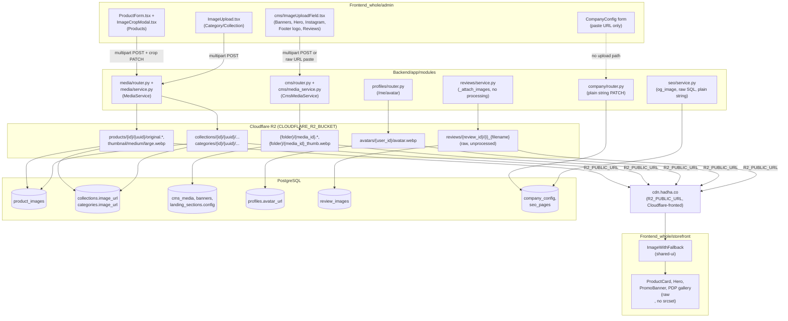

# Universal Image Pipeline Analysis — Hadha.co

**Scope:** Read-only architecture audit of every image entry point, processing step, storage layout, and rendering surface across the monorepo at `F:\Work\Hadha.co\Project`.
**Repo shape (verified):** `Backend/` — FastAPI, modular monolith under `Backend/app/modules/*`, Alembic migrations under `Backend/alembic/versions/`, base schema provisioned by `Backend/supabase/sql/*.sql`. `Frontend_whole/` — pnpm/turbo-style monorepo split into `storefront/` (customer-facing), `admin/` (staff dashboard), and shared packages `packages/shared-ui`, `packages/shared-api`, `packages/shared-types`, `packages/shared-utils`.
**Method:** Direct `Read`/`Glob`/`Grep` across both codebases; all file:line citations below were opened and read directly (not inferred). No code was modified.

---

## 1. Executive Summary

Hadha.co's image pipeline is **not one pipeline — it is at least four independent pipelines** that happen to share a single R2 bucket and a single `MediaService`/`CmsMediaService` pair of Python classes:

1. **Product images** — the most mature path: original + 3 WebP variants (thumbnail/medium/large), a dedicated crop UI (`react-easy-crop`, 1:1 aspect), crop metadata persisted and re-editable, cache-busting via `?v=<updated_at>`.
2. **Collection / Category cover images** — same backend variant pipeline as products, but **no crop UI at all** in the admin — a single raw upload with an `aspect-video` preview box that has no relationship to how the image is actually rendered (square cards) downstream.
3. **CMS media (hero banners, promo banners, Instagram gallery, footer logo, testimonial photos)** — an entirely separate `CmsMediaService`: single 400×400 thumbnail only (no medium/large), 50 MB limit vs. 10 MB elsewhere, supports video, and — critically — exposes a **raw URL paste field that bypasses upload, validation, and CDN entirely**.
4. **Avatars, review images, company logo, SEO OG image** — each a one-off: avatars get a single fixed-key 400×400 WebP with no cache-busting; review images get **zero processing** (raw bytes, unsanitized filename in the R2 key, no validation); company logo and SEO OG image have **no upload endpoint at all** — they're plain string fields an admin must populate by pasting a URL obtained elsewhere.

On the frontend, the storefront renders images with **no responsive image techniques whatsoever** — no `srcSet`, no `sizes`, no `<picture>`, hardcoded `width={800} height={800}` on product cards regardless of actual rendered size, and the CMS `Banner` model's `mobile_image_url` column is populated by the admin but **never read** by either `Hero.tsx` or `PromoBanner.tsx` on the storefront — both hardcode `desktop_image_url` for all viewports. Product image reordering (`sort_order` column exists, is indexed, is used for `ORDER BY`) has **no admin UI or API endpoint to change it** — it is permanently upload order.

The architecture is functional and the product-image path in particular is well-engineered (untouched-original preservation, re-editable crops, proper cache versioning). The main risks are **inconsistency across modules** (three different upload components, two different backend services, three different validation regimes) and **missed performance wins** (no responsive images, no `Cache-Control` headers on any R2 object, no mobile-specific creative delivery despite the schema supporting it).

---

## 2. Complete Architecture



---

## 3. Every Image Module

| # | Module | Route (admin) | Component (admin) | Backend Endpoint | DB Table | Storage Key Pattern | Upload Service |
|---|---|---|---|---|---|---|---|
| 1 | Product gallery | `/admin/products/:id` | `admin/src/components/admin/products/ProductForm.tsx`, `ImageCropModal.tsx` | `POST/DELETE /admin/products/{id}/images`, `PATCH .../crop`, `PATCH .../primary`, `PUT .../replace` (`Backend/app/modules/media/router.py:62-261`) | `product_images` | `products/{product_id}/{image_uuid}/{original\|thumbnail\|medium\|large}` | `MediaService` |
| 2 | Collection cover | `/admin/collections/:id` | `admin/src/components/admin/collections/CollectionForm.tsx` + `ImageUpload.tsx` | `POST/DELETE /admin/collections/{id}/image` (`media/router.py:269-338`) | `collections.image_url` | `collections/{id}/{image_uuid}/...` | `MediaService.upload_entity_cover` |
| 3 | Category cover | `/admin/categories/:id` | `admin/src/components/admin/categories/CategoryForm.tsx` + `ImageUpload.tsx` | `POST/DELETE /admin/categories/{id}/image` (`media/router.py:346-415`) | `categories.image_url` | `categories/{id}/{image_uuid}/...` | `MediaService.upload_entity_cover` |
| 4 | Hero carousel slides | `/admin/cms` (homepage builder) | `admin/src/components/cms/ImageUploadField.tsx` | `POST /admin/media/upload`, `GET/PATCH/DELETE /admin/media*` (`Backend/app/modules/cms/router.py:336-396`) | `cms_media`; URL stored inside `landing_sections.config`/`draft_config` JSONB | `{folder}/{media_id}.{ext}` (+ `_thumb.webp`) | `CmsMediaService` |
| 5 | Promo/Image banners | `/admin/cms` and `banners` CRUD | `ImageUploadField.tsx`; `Banner` CRUD `GET/POST/PATCH/DELETE /admin/banners` (`cms/router.py:92-128`) | same media endpoints as #4 | `banners.desktop_image_url`, `banners.mobile_image_url` | same as #4 | `CmsMediaService` |
| 6 | Instagram gallery, footer logo, testimonial/review-card photos, collection-card hover images, video posters | `/admin/cms` | `ImageUploadField.tsx` (multiple usages) | same media endpoints as #4 | `landing_sections.config`/`cms_section_items.config` JSONB | same as #4 | `CmsMediaService` |
| 7 | User avatar | storefront `/account` (not admin) | not audited in storefront component detail (backend confirmed) | `PATCH /me/avatar` (`Backend/app/modules/profiles/router.py:67-82`) | `profiles.avatar_url` | `avatars/{user_id}/avatar.webp` (fixed key) | `MediaService.upload_avatar` |
| 8 | Review photos | storefront review submission form | not audited in storefront component detail (backend confirmed) | `POST /reviews` with `images: list[UploadFile]` (`Backend/app/modules/reviews/router.py:88-117`) | `review_images` | `reviews/{review_id}/{i}_{filename}` (raw uploaded filename used verbatim) | `MediaService.upload_bytes` (no resizing) |
| 9 | Company / brand logo, packing-slip logo, shipping-label logo | `/admin/settings` (company config form) | plain URL text field (per admin sub-audit); no upload widget found in `company` module | `PATCH /admin/company` (`Backend/app/modules/company/router.py:29-39`) | `company_config.logo_url`, `.packing_slip_logo_url`, `.shipping_label_logo_url` (+ `logo_r2_key`) | n/a — no dedicated upload; admin pastes a URL obtained from module #4/#6 | none (no upload service invoked) |
| 10 | SEO / OpenGraph image | SEO settings screen (not deep-audited on frontend) | — | no upload route found; `og_image` set via `SeoService.upsert_page` raw SQL (`Backend/app/modules/seo/service.py:24-43`) | `seo_pages.og_image` (raw SQL table, `Backend/supabase/sql/002_catalog.sql:207`) | n/a | none |
| 11 | Order line-item image snapshot | n/a (system-generated) | n/a | populated internally at order-creation time, not an upload endpoint | `order_items.image_url` (migration `0011_order_item_image_url.py:22-26`) | copies the product image URL at time of purchase, decoupled from `product_images` | none (copy, not upload) |
| 12 | Fulfillment PDF logo | consumed, not uploaded | — | `fulfillment/service.py:418-435` fetches `company_config.logo_url` over HTTP (`httpx.get`, 5s timeout) to embed in packing-slip/shipping-label PDFs, falling back to a bundled `hadha-logo.png` | reads `company_config` | n/a | none (consumer only) |

**Modules investigated and found to have no distinct image pipeline:** About/Team members and Blog — no `models.py`/routes matching `team_member`, `blog`, `testimonial` (as dedicated tables) were found anywhere under `Backend/app/modules/*` (grep across all modules returned no matches). Testimonials exist only as a CMS section type (`landing_sections`/`cms_section_items` with `section_type` = a testimonials-like value) whose photo fields live inside the JSONB `config`, uploaded via module #6's `ImageUploadField`. There is no standalone Blog or Team page module in this codebase as of this audit.

---

## 4. Upload Flow

### Product images (most complete pipeline)
1. Admin selects/drops file in `ProductForm.tsx` gallery dropzone (multi-file, `accept="image/jpeg,image/png,image/webp"`).
2. `POST /admin/products/{id}/images` (multipart) → `media/router.py:68-111`.
3. Backend validation: `_validate_image` (`media/router.py:48-54`) — content-type allow-list `{image/jpeg, image/png, image/webp}`, 10 MB max, based on the client-supplied `Content-Type` header (not byte-sniffed).
4. `MediaService.upload_product_image` (`media/service.py:222-234`) → `_upload_image_variants`: uploads `original.{ext}` as-is, opens with Pillow, `_normalize_image` pads to a white square canvas (~12.5% margin, never crops/stretches), then `_generate_and_upload_variants` produces thumbnail (200×200), medium (600×600), large (1200×1200), all WebP quality 85.
5. `ProductImage` row inserted (`ProductRepository.add_image`) with all four URLs, `sort_order=0`, `is_primary` from query param.
6. Redis product-list cache busted (`_bust_product_list_cache`).
7. **Crop (optional, separate step):** admin opens `ImageCropModal.tsx` (`react-easy-crop`, 1:1 aspect locked), saves crop box → `PATCH .../images/{id}/crop` → `MediaService.apply_crop_to_product_image` (`media/service.py:243-275`) re-fetches the **untouched original** from R2, applies rotation then crop in the original's own pixel space, regenerates thumbnail/medium/large only (original is never touched), persists crop_x/y/width/height/zoom/rotation + new URLs.
8. **Replace (optional):** `PUT .../images/{id}/replace` purges the old R2 folder and re-runs the full upload pipeline at the same key, resetting all crop fields to `NULL` (new original has no crop yet — comment in `media/service.py:284-292` explicitly notes the caller should reopen the crop editor).

### Collection / Category cover images
1. `ImageUpload.tsx` (`admin/src/components/admin/ImageUpload.tsx`) — single-file dropzone, client-side validates `image/(jpeg|png|webp)` and 10 MB (lines 37, 41), simulated (non-real) progress bar (`setInterval`, line 57).
2. `POST /admin/collections/{id}/image` or `/admin/categories/{id}/image` (`media/router.py:275-312`, `352-389`).
3. Old R2 image folder deleted first if one exists (`MediaService.folder_prefix_from_url` + `delete_entity_folder`).
4. `MediaService.upload_entity_cover` — same normalize/variant pipeline as products (thumbnail/medium/large WebP, white-padded square).
5. Only `urls["large"]` is persisted to `collections.image_url` / `categories.image_url` — **no crop step, no thumbnail/medium URL persisted**, despite them being generated and uploaded to R2 (orphaned but harmless storage).

### CMS media (banners, hero, gallery, footer logo, testimonials)
1. `ImageUploadField.tsx` (`admin/src/components/cms/ImageUploadField.tsx`) — click-to-upload only (no drag-drop), **no client-side type/size validation** beyond the HTML `accept="image/*"` hint (line 22).
2. `POST /cms/admin/media/upload` (`cms/router.py:359-373`) → `CmsMediaService.upload` (`cms/media_service.py:61-143`).
3. Server validates against `_IMAGE_MIMES`/`_VIDEO_MIMES` (jpeg/png/webp/gif/avif + mp4/webm/ogg), 50 MB cap.
4. Original stored as-is at `{folder}/{media_id}.{ext}`; if image, a **single** 400×400 WebP thumbnail generated (wrapped in a bare `try/except: pass` — silent failure leaves `width`/`height`/`thumbnail_url` all `NULL`, `cms/media_service.py:110-124`). No medium/large variants at all.
5. `cms_media` row created; the returned `cdn_url` is what the admin's `ImageUploadField` writes into the parent config (banner/section item JSON).
6. **Escape hatch:** `ImageUploadField.tsx` also renders a plain text input bound to the same `value`/`onChange` (lines 73-79) — an admin can type or paste any URL directly, completely bypassing upload, validation, R2, and the CDN.

### Avatar
1. `PATCH /me/avatar` (`profiles/router.py:67-82`) — **no explicit `_validate_image`-style call before processing** (unlike the media router). Relies on `PIL.Image.open()` raising for non-image bytes.
2. `MediaService.upload_avatar` — single 400×400 WebP at the fixed key `avatars/{user_id}/avatar.webp`; re-upload always overwrites (no history, no cache-busting mechanism since the URL never changes).

### Review images
1. `POST /reviews` accepts `images: list[UploadFile]` alongside review text/rating.
2. `ReviewService._attach_images` (`reviews/service.py:276-291`) caps at 5 images (`images[:5]`) — **no MIME check, no size check, no dimension check**.
3. `MediaService.upload_bytes` (`media/service.py:366-374`) — raw pass-through, no Pillow processing, no resizing, no WebP conversion.
4. R2 key: `reviews/{review_id}/{i}_{filename}` — the **raw client-supplied filename is used verbatim** in the storage key with no sanitization visible in the traced call chain.

### Company logo / SEO OG image
No upload endpoint. `PATCH /admin/company` and whatever endpoint wraps `SeoService.upsert_page` accept plain string URL fields (`logo_url`, `packing_slip_logo_url`, `shipping_label_logo_url`, `og_image`). The admin must first upload via the CMS media library (module #4 above) to obtain a `cdn_url`, then paste it into these forms — an indirect, easy-to-get-wrong two-step workflow with no guardrail preventing an arbitrary external URL.

---

## 5. Rendering Flow

Storefront (`Frontend_whole/storefront/src`) renders **every** image via a raw `` tag. **Correction confirmed by direct grep:** the shared `ImageWithFallback` component (`Frontend_whole/packages/shared-ui/src/common/ImageWithFallback.tsx:13-51` — `Skeleton` while loading, `ImageOff` icon fallback on error, `loading="lazy"` default, `decoding="async"`, opacity fade-in) has **zero import/usage anywhere under `storefront/src`** — it is only consumed by the **admin** app (`admin/src/components/common/ImageWithFallback.tsx` re-export, used inside `admin/src/components/cms/ImageUploadField.tsx:54-64` for the upload-preview thumbnail). The storefront hand-rolls its own loading/error handling per component instead — inconsistently: some use an `onError` handler that swaps to a fallback image (e.g. `ShopByGender.tsx` gender-avatar and sub-category tiles), most have **no fallback at all** (cart, checkout, wishlist, account pages) — a broken/expired image URL renders the browser's default broken-image icon with no graceful degradation.

Full raw-`` inventory (36 occurrences found via repo-wide grep across `storefront/src`), representative examples:
- `components/site/Hero.tsx:114-122` — hero slides, `width={1920} height={1080}`, `fetchPriority` high on first slide only.
- `components/site/ProductCard.tsx:43-50, 54-62` — PLP/grid card front+back faces, `width={800} height={800}`, `loading="lazy"`.
- `components/site/FeaturedCollection.tsx:45-52` (1200×1500), `PromoBanner.tsx:23-30` (1920×720), `ShopByCategory.tsx:49-56` (800×800), `InstagramSection.tsx:73-80` (500×500) — all fixed intrinsic-size attributes, `loading="lazy"`, no `srcSet`.
- `components/site/Header.tsx:126-130, 240, 289`, `components/site/Footer.tsx:55-65` — logo marks, no `loading`/`width`/`height` (acceptable — above-the-fold/small assets).
- `routes/products.$slug.tsx:300-308` — PDP thumbnail rail, 80×80, `loading="lazy"`; **the PDP's primary `ProductImageViewer` image (`products.$slug.tsx:1209-1235`, the page's likely LCP element) has no `loading` or `fetchPriority` attribute at all** — a candidate LCP regression, since it neither preloads nor explicitly deprioritizes.
- `routes/cart.tsx:182-190` (96×96, `lazy`), `components/site/CartDrawer.tsx:50-54`, `routes/checkout.tsx:653-657`, `routes/wishlist.tsx:55-59`, `routes/account.index.tsx` (multiple: wishlist preview, order items, avatar) — thumbnails with **no `loading` attribute at all** (not even eager/lazy specified), inconsistent with the `lazy`-tagged grid tiles elsewhere.
- `components/common/SearchOverlay.tsx:183-232` — search result/category thumbnails, `loading="lazy"`.

Only **two** images in the entire storefront use `fetchPriority="high"`: `Hero.tsx:121` (first slide) and `collections.$slug.tsx:107` (collection banner). No other image is prioritized or preloaded.

### Data mapping (backend → frontend image URL selection)
`Frontend_whole/storefront/src/lib/api/mappers.ts`:
- `toProduct` (list context, line 12): `image: p.primary_image` — the list endpoint's `primary_image` field (`Backend/app/modules/catalog/schemas.py:306`) is populated server-side; **which variant size backs `primary_image` was not independently confirmed in this pass** — flagged as unverified, recommend checking `ProductRepository`'s list query.
- `toProductDetail` (PDP, lines 39-49): `mediumOf(i) = i.medium_url ?? i.url`; `largeOf(i) = i.large_url ?? i.medium_url ?? i.url`. Card/list image = `medium_url` (600×600); PDP gallery zoom = `large_url` (1200×1200) via a separate `galleryLarge` array (`products.$slug.tsx:196-197, 313-314`).
- `toCollection` (line 86): `image: c.image_url` — this is **always the `large` (1200×1200) variant**, since that's the only URL `collections.image_url`/`categories.image_url` persist (see §4) — collection/category cards render a 1200px image regardless of their actual on-screen size.

### Hardcoded dimensions / no responsive images
- `ProductCard.tsx:47-48, 59-60` — `width={800} height={800}` hardcoded on both front/back `` regardless of the card's actual rendered size (which shrinks substantially on mobile grid layouts). Container is `aspect-square` with `object-contain` (`ProductCard.tsx:34, 49, 61`).
- `Hero.tsx:112-123` — `h-[78vh] min-h-[560px]` full-bleed hero, `` fixed at `width={1920} height={1080}`, `fetchPriority={i===0 ? "high" : "low"}` (good LCP hint on the first slide), but **every viewport downloads the same 1920×1080 desktop asset** — see Gap Analysis.
- `PromoBanner.tsx:19-27` — `h-[55vh] min-h-[400px]`, single `desktop_image_url`, no mobile alternative even though `PromoBannerConfig`'s only image field is `desktop_image_url` (no `mobile_image_url` field exists in that particular CMS section's TS type, unlike the DB-level `Banner` model which does have both columns for the `/admin/banners` CRUD-managed banners — these are two different banner mechanisms, see Gap Analysis).

### `srcSet`/`sizes`/`<picture>` usage — repo-wide search result
Grep for `srcSet|srcset|sizes=|picture|fetchPriority` across `storefront/src` and `admin/src` returned matches in only **3 files total**: `storefront/src/routes/collections.$slug.tsx` (`fetchPriority="high"` on the collection banner, no actual `srcSet`/`sizes`), `storefront/src/components/site/Hero.tsx` (`fetchPriority` only, no `srcSet`), and `admin/src/components/site/Hero.tsx` (same, reused for CMS live-preview). **No component anywhere in either app uses `srcSet`, `sizes`, or a `<picture>` element.**

### CDN preconnect — confirmed absent
`storefront/src/routes/__root.tsx:113-118` contains the app's only `<link rel="preconnect">` entries, and they target **Google Fonts** (`fonts.googleapis.com`, `fonts.gstatic.com`) exclusively. There is no `preconnect`/`dns-prefetch` to the image CDN host (`cdn.hadha.co`) anywhere, and no `<link rel="preload" as="image">` for the hero/LCP image — the only LCP optimization in place is the in-DOM `fetchPriority="high"` noted above, which does not get the connection-warming benefit a preconnect would provide for a cross-origin CDN request.

---

## 6. Storage Flow

Two independent boto3-based R2 client instantiations (`MediaService._get_r2_client`, `media/service.py:22-30`; `CmsMediaService._r2`, `cms/media_service.py:26-34`) — near-identical code, not shared.

```
R2 bucket (CLOUDFLARE_R2_BUCKET, e.g. "hadha-media")
├── products/{product_id}/{image_uuid}/
│   ├── original.{ext}          ← never overwritten by crop; replaced only by "replace" op
│   ├── thumbnail.webp          ← 200×200, q85
│   ├── medium.webp             ← 600×600, q85
│   └── large.webp              ← 1200×1200, q85
├── collections/{collection_id}/{image_uuid}/    (same 4-file layout; only large.webp URL persisted to DB)
├── categories/{category_id}/{image_uuid}/       (same 4-file layout; only large.webp URL persisted to DB)
├── {cms_folder}/{media_id}.{ext}                ← CMS media library original (any folder path admin chooses)
├── {cms_folder}/{media_id}_thumb.webp           ← single 400×400 thumbnail (images only)
├── avatars/{user_id}/avatar.webp                ← single fixed-key file, always overwritten
└── reviews/{review_id}/{i}_{raw_filename}       ← raw bytes, unprocessed, unsanitized filename
```

- **Public URL construction:** `_public_url(key) = f"{R2_PUBLIC_URL.rstrip('/')}/{key}"`, duplicated verbatim in both services (`media/service.py:117-119`, `cms/media_service.py:37-38`). `R2_PUBLIC_URL` = `CLOUDFLARE_R2_PUBLIC_URL` = `https://cdn.hadha.co` per `Backend/.env.example:73-80`.
- **Cache-Control headers:** grepped every `put_object` call in both services — **none pass a `CacheControl` parameter.** R2/Cloudflare will apply its own default caching behavior for the bucket/custom-domain, not an application-controlled policy.
- **Cache busting:** only `product_images` gets it, via `updated_at` (added by migration `0032_product_image_large_url_and_version.py`) and `cache_busted_url()` in `catalog/schemas.py` appending `?v=<unix_ts>` to `url`/`thumbnail_url`/`medium_url`/`large_url` at serialization time. Collections/categories sidestep the problem incidentally (fresh UUID per upload → new URL). Avatars do **not** — the fixed key `avatars/{user_id}/avatar.webp` never changes on re-upload, so a stale cached avatar can persist in browsers/CDN indefinitely with no versioning mechanism.
- **Original preservation:** guaranteed only for product images (explicit design goal per code comments in `media/service.py:169-173, 253-260`). Collections/categories/CMS media/avatars have no "original vs. derived" distinction beyond the fact that `original.{ext}` is still uploaded for entity-cover images too (just never re-derived from, since there's no crop feature for those modules).
- **Deletion:** `delete_entity_folder(prefix)` does a `list_objects_v2` + `delete_objects` bulk purge. Called on collection/category image replace, product image delete/replace. **All deletion call sites wrap the R2 call in a bare `try/except: pass`** (`media/router.py:129-132, 293-296, 332-335, 369-373, 409-412`) — a failed R2 delete is silently swallowed after the DB row is already gone, risking orphaned storage with no logging/alerting.
- **Presigned uploads:** `MediaService.get_presigned_upload_url` (`media/service.py:376-389`) generates a presigned PUT URL for direct browser→R2 uploads but **no router/frontend call site was found** referencing it anywhere in the modules read — likely dead code, or an unaudited direct-upload path; flagged for follow-up rather than assumed.

---

## 7. Crop Analysis

| Aspect | Products | Collections / Categories | CMS media | Avatar | Review images |
|---|---|---|---|---|---|
| Crop library | `react-easy-crop` v6 | none | none | none | none |
| Crop UI | `admin/src/components/admin/products/ImageCropModal.tsx` (164 lines) | none | none | none | none |
| Aspect lock | 1:1, hardcoded `const ASPECT = 1` (line 35) — comment states this matches storefront cards/cart/wishlist rendering | n/a | n/a | n/a (server crops to 400×400 square implicitly via `thumbnail()`, no user framing) | n/a |
| Rotation | -180°..180°, 1° steps (`ImageCropModal.tsx:131-138`) | n/a | n/a | n/a | n/a |
| Zoom | 1x–5x, 0.05 steps, scroll-to-zoom enabled (`:120-127, 107`) | n/a | n/a | n/a | n/a |
| Shape support | square only (no circle/free option) | n/a | n/a | n/a | n/a |
| Crop persistence | `crop_x/y/width/height/zoom/rotation` on `product_images` (pixel coords in the *original* image's space) | n/a — `collections`/`categories` have no crop columns at all | n/a | n/a | n/a |
| Re-edit capability | Yes — `initialCroppedAreaPixels` restored from saved DB values (`ProductForm.tsx:2558-2571` → `ImageCropModal.tsx:109`) | n/a | n/a | n/a | n/a |
| Reset on replace | Yes — replacing the original file nulls all crop fields, forces re-crop (`media/service.py:277-296`, `ProductForm.tsx:2532-2534`) | n/a | n/a | n/a | n/a |
| Mobile crop UI | Same `Dialog`-based modal reused for all breakpoints — no distinct mobile flow found | n/a | n/a | n/a | n/a |

**Gap:** Collections and Categories go through the exact same square-normalizing backend pipeline as products (`MediaService.upload_entity_cover` calls `_normalize_image` then generates the same thumbnail/medium/large set) but have **no crop UI whatsoever** in the admin — `ImageUpload.tsx` only shows an `aspect-video` preview box during upload (`ImageUpload.tsx:94, 131`), which doesn't match the square normalization actually applied server-side, nor the square rendering downstream on collection/category cards. Admins have no way to choose which part of a non-square source photo becomes the visible square crop for these two modules.

---

## 8. Responsive Analysis

**Backend-generated size tiers (products/collections/categories):** thumbnail 200×200, medium 600×600, large 1200×1200 — all fixed absolute pixel targets, not tied to any specific breakpoint or DPR (device-pixel-ratio) awareness.

**Frontend consumption of those tiers:** confirmed hardcoded, not responsive —
- Product list/card: always `medium_url` (600×600) regardless of viewport (`mappers.ts:39, 46`).
- PDP gallery thumbnails: `medium_url`; PDP zoom/lightbox: `large_url` (`mappers.ts:40, 48-49`; `products.$slug.tsx:196-197, 313-314`) — again, not viewport-dependent, just interaction-state-dependent (zoomed vs. not).
- Collection/category cards: always `large_url`-equivalent (the only URL stored), i.e. every collection card downloads a 1200×1200 image even in a 4-column mobile grid.
- CMS media (hero, banners, gallery): no size tiers at all beyond one 400×400 thumbnail (used only inside the admin media-library picker, not on the storefront) — the storefront hero/banner always renders the **full original** image, which could be arbitrarily large (up to 50 MB source per `_MAX_FILE_SIZE` in `cms/media_service.py:23`).

**Breakpoint-aware image swapping:** `Banner` DB model has both `desktop_image_url` and `mobile_image_url` (`cms/models.py:35-36`) and the admin's `ImageUploadField` usage list (per the admin sub-audit) shows dedicated desktop/mobile/tablet upload slots for the Hero Carousel CMS section (`admin.cms.index.tsx:645-663`) and desktop/mobile slots for the Image Banner section (`:861-872`). **However, on the storefront:**
- `Hero.tsx:57-70` (`cmsItemToSlide`) reads only `c.desktop_image_url` — `mobile_image_url` is captured by the admin, stored, and then **never read** by the rendering component.
- `PromoBanner.tsx:8, 19` — the `PromoBannerConfig` TS type used here only has a `desktop_image_url` field to begin with; whether this is the same CMS section as the DB `banners` table or a different `landing_sections`-JSONB-backed section was not fully reconciled in this pass, but either way the rendered component never differentiates by viewport.
- No `<picture>` + `<source media="(max-width: ...)">` pattern exists anywhere in the storefront.

**Grid layouts / breakpoints:** Tailwind responsive prefixes (`sm:`/`md:`/`lg:`) are used extensively for *layout* (grid column counts, padding) across `ProductGrid.tsx`, `ShopByCategory.tsx`, `FeaturedCollection.tsx`, etc. (not individually cited here — layout-only concern, not an image-pipeline gap), but the **image asset itself never changes** with those breakpoints — only its CSS box size does, meaning mobile users download the same byte payload as desktop for a visually much smaller rendered image.

**DPR (Retina) support:** none found — no `srcSet="... 1x, ... 2x"` pattern anywhere.

---

## 9. Component Inventory (file:line)

### Shared (`Frontend_whole/packages/shared-ui/src`)
- `common/ImageWithFallback.tsx:13-51` — shared fallback/skeleton/lazy-load image wrapper, re-exported by both apps at `admin/src/components/common/ImageWithFallback.tsx` and (presumably identically) in storefront.
- `loading/ProductCardSkeleton.tsx`, `loading/ProductGridSkeleton.tsx` — skeleton loaders used while product data (incl. images) is loading.
- `ui/skeleton.tsx`, `ui/aspect-ratio.tsx`, `ui/avatar.tsx`, `ui/carousel.tsx` — generic primitives consumed by image-bearing features.

### Admin-only (`Frontend_whole/admin/src`)
- `components/admin/ImageUpload.tsx:1-166` — single-image drag/drop uploader (Category, Collection). Client validation: type regex line 37, 10 MB line 41. Simulated progress bar (not real upload progress), lines 55-59.
- `components/admin/products/ImageCropModal.tsx:1-164` — `react-easy-crop` wrapper, 1:1 aspect, zoom/rotate sliders, re-edit support (see §7).
- `components/admin/products/ProductForm.tsx` — 3000+ lines; image-gallery section approx. lines 1268-1484 (dropzone, per-image actions), crop-queue orchestration lines 2453-2726 (`enqueueCrop`, `applyPendingCrop`, `handleCropSave`), save handlers lines 2728-2850 (`handleCreate`, `handleUpdate` — sequential per-image upload + optional crop apply).
- `components/cms/ImageUploadField.tsx:1-108` — generic CMS upload-or-paste-URL field, used across `admin.cms.index.tsx` for Hero (≈645-663), Banner (≈861-872), Video poster (≈986-998), Instagram (≈1084-1087), Collection Cards (≈1388-1399), Reviews/testimonial photo (≈1677-1681), Footer logo (≈1804-1808) — line numbers per the corroborated sub-audit, not independently re-verified line-by-line in this pass.
- `components/admin/categories/CategoryForm.tsx:291-309` — wires `ImageUpload` to `/admin/categories/{id}/image`.
- `components/admin/collections/CollectionForm.tsx:312-333` — wires `ImageUpload` to `/admin/collections/{id}/image`.
- `routes/admin.cms.media.tsx` — CMS Media Library browser (grid, folder/mime filters, pagination, copy-URL, delete) per sub-audit; not independently re-opened in this pass.

### Storefront-only (`Frontend_whole/storefront/src`)
- `components/site/ProductCard.tsx:1-70+` — 3D flip-card with front/back raw `` (lines 43-63), hardcoded `width={800} height={800}`, `object-contain`, `loading="lazy"`.
- `components/site/Hero.tsx:1-140+` — full-bleed carousel, raw `` per slide (lines 114-122), `fetchPriority` high/low by index, desktop-only image source (line 60).
- `components/site/PromoBanner.tsx:17-27` — single raw ``, desktop-only source.
- `components/site/FeaturedCollection.tsx`, `Footer.tsx`, `InstagramSection.tsx`, `ShopByCategory.tsx`, `ShopByGender.tsx`, `Reviews.tsx`, `Newsletter.tsx`, `AnnouncementBar.tsx` — each renders CMS- or catalog-sourced images via raw `` or `ImageWithFallback` (not individually line-audited in this pass; flagged as consistent with the ProductCard/Hero pattern based on repo-wide grep showing no `srcSet` usage in any of them).
- `components/cms/ImageUploadField.tsx` — a **duplicate file** of the admin component exists under the storefront tree too (used for any customer-facing CMS editing surface, if one exists — not confirmed in this pass whether storefront actually exposes an authoring UI or this is a leftover/shared copy-paste from the monorepo split).
- `lib/api/mappers.ts:5-49` — the single source of truth for which image-size field (`primary_image`, `medium_url`, `large_url`, `image_url`) each storefront view type consumes (see §5).

---

## 10. Database Inventory

| Table | Key image columns | Variant/size columns | Crop metadata | Versioning/cache-bust | Notes |
|---|---|---|---|---|---|
| `product_images` (`catalog/models.py:273-318`) | `url` (original) | `thumbnail_url`, `medium_url`, `large_url` | `crop_x/y/width/height` (Numeric 10,2), `crop_zoom` (5,2), `crop_rotation` (6,2) | `updated_at` (onupdate) → `?v=` param | Also `alt_text`, `is_primary`, `sort_order` (unused by any reorder UI — see Gaps) |
| `collections` (`collections/models.py:20`) | `image_url` (large variant only) | none persisted (thumbnail/medium generated in R2, URLs discarded) | none | none | |
| `categories` (`categories/models.py:25`) | `image_url` (large variant only) | same as collections | none | none | |
| `banners` (`cms/models.py:24-59`) | `desktop_image_url`, `mobile_image_url` | none | none | none | `mobile_image_url` populated by admin but unread by storefront (§8) |
| `landing_sections` / `cms_section_items` (`cms/models.py:62-118`) | none (URLs live inside `config`/`draft_config` JSONB, untyped at DB level) | n/a | n/a | `version_number`, `cms_version_history` snapshot table | |
| `cms_media` (`cms/models.py:121-154`) | `cdn_url`, `thumbnail_url` | single thumbnail only | none | none (`updated_at` exists but not used for URL versioning) | `width`,`height`,`duration`,`file_size`,`mime_type`,`tags`,`extra_meta` JSONB, `usage_count`, soft-delete `deleted_at` |
| `company_config` (`company/models.py:9-31`) | `logo_url`, `packing_slip_logo_url`, `shipping_label_logo_url` | none | none | none | `logo_r2_key` stored separately from `logo_url` — the only place besides `review_images` that tracks the raw R2 key alongside the URL |
| `profiles` (`profiles/models.py:21`) | `avatar_url` | none (single 400×400 only) | none | none | |
| `review_images` (`reviews/models.py:94-110`) | `url` | none | none | none | `r2_key` stored; `sort_order`; no `updated_at` |
| `order_items` (`orders/models.py:209`) | `image_url` | n/a (snapshot copy) | n/a | n/a (immutable snapshot) | Migration `0011_order_item_image_url.py` |
| `seo_pages` (raw SQL, `supabase/sql/002_catalog.sql:201-216`) | `og_image` | none | none | none | Not an ORM model; accessed via raw SQL in `seo/service.py` |

**Alembic migrations touching images (chronological):** `0004_cms_homepage_extension` (creates `cms_media`, `landing_sections`, `cms_section_items`, version/publish-log tables) → `0011_order_item_image_url` → `0013_company_config` (adds `logo_url`/`logo_r2_key`) → `0019_per_template_logos` (adds packing-slip/shipping-label logo columns) → `0031_product_image_crop_metadata` → `0032_product_image_large_url_and_version`. Base schema for `product_images`, `collections`, `categories`, `banners`, `profiles`, `seo_pages` predates Alembic and is provisioned by `Backend/supabase/sql/*.sql`, anchored via the no-op `0001_baseline.py` migration.

**Missing/notable gaps in the schema:** no `alt_text` on `collections.image_url`/`categories.image_url`/`banners.*` (only `product_images.alt_text` and `cms_media.alt_text` exist); no width/height columns on any image table except `cms_media`; no crop metadata anywhere except `product_images`.

---

## 11. Image Matrix

| Module | Upload | Crop | Preview | Responsive (srcset/variants consumed) | Storage (R2 layout) | Variants Generated | Rendering |
|---|---|---|---|---|---|---|---|
| Product gallery | Yes, multipart, 10MB/3-type limit | Yes, 1:1, re-editable | Local blob preview + saved-image grid | Backend generates 3 tiers; frontend picks by *context* (medium for card/list, large for zoom) not by *viewport* | `products/{id}/{uuid}/{orig,thumb,medium,large}` | 3 (thumb/medium/large) + original | Card/PDP thumbnails via `medium_url`, zoom via `large_url`; no srcset |
| Collection cover | Yes, multipart, 10MB/3-type limit | **No** | Local blob preview only | Frontend always uses `large_url`-equivalent regardless of card size | `collections/{id}/{uuid}/...` | 3 generated, 2 discarded (only large persisted) | Raw ``/`ImageWithFallback`, no srcset |
| Category cover | Yes, multipart, 10MB/3-type limit | **No** | Local blob preview only | Same as collections | `categories/{id}/{uuid}/...` | 3 generated, 2 discarded | Same as collections |
| Hero carousel | Yes (CMS media) or raw URL paste | **No** | `ImageUploadField` inline preview | **No** — full original served at all viewports; `mobile_image_url`/tablet slot exists but is never read by storefront `Hero.tsx` | `{folder}/{media_id}.{ext}` | 1 thumbnail (admin-picker only, not used on storefront) | Full-bleed raw ``, `fetchPriority` hint only |
| Promo/Image banner | Yes (CMS media) or raw URL paste | **No** | `ImageUploadField` inline preview | **No** | Same as Hero | Same as Hero | Same as Hero |
| Instagram gallery / footer logo / testimonial photos | Yes (CMS media) or raw URL paste | **No** | `ImageUploadField` inline preview | **No** | Same as Hero | Same as Hero | Raw `` |
| Avatar | Yes, multipart, **no explicit backend validation call** | **No** | Not audited on storefront | N/A (fixed 400×400) | `avatars/{user_id}/avatar.webp` (fixed key, no versioning) | 1 (400×400) | Not audited on storefront |
| Review photos | Yes, multipart, **zero validation, zero processing** | **No** | Not audited on storefront | N/A (raw original size served) | `reviews/{review_id}/{i}_{raw filename}` | 0 (raw pass-through) | Not audited on storefront |
| Company/brand logo | **No upload endpoint** — paste URL only | **No** | None | N/A | Wherever the pasted CDN URL points | 0 | Consumed server-side for PDF generation (`fulfillment/service.py`) |
| SEO/OG image | **No upload endpoint** — paste URL only | **No** | None | N/A | Wherever the pasted CDN URL points | 0 | Consumed by page `<meta>` tags (not independently verified in this pass) |

---

## 12. Architecture Diagrams

### Overall Image Pipeline (see §2 for the full Mermaid diagram)

### Module-wise flow — Product image (representative of the "complete" pipeline)
```
Admin picks file → ProductForm dropzone
      │
      ▼
POST /admin/products/{id}/images  (media/router.py:68)
      │  _validate_image() [type + 10MB]
      ▼
MediaService.upload_product_image
      │  put original as-is
      │  Pillow: _normalize_image (white square pad)
      │  generate thumbnail(200)/medium(600)/large(1200) WebP q85
      ▼
R2: products/{id}/{uuid}/{original,thumbnail,medium,large}
      │
      ▼
INSERT product_images row (url, thumbnail_url, medium_url, large_url, sort_order=0, is_primary)
      │
      ▼ (optional)
Admin opens ImageCropModal → PATCH .../crop
      │  fetch untouched original from R2
      │  rotate + crop in original's pixel space
      │  regenerate thumbnail/medium/large (original untouched)
      ▼
UPDATE product_images (crop_* cols, new derived URLs, updated_at bumped)
      │
      ▼
ProductImageResponse serialization → cache_busted_url() appends ?v=<updated_at>
      │
      ▼
Storefront mappers.ts: card=medium_url, PDP zoom=large_url
      │
      ▼
Raw  / ImageWithFallback, no srcset, served from cdn.hadha.co
```

### Module-wise flow — CMS Hero banner (representative of the "thin" pipeline)
```
Admin picks file or pastes URL → ImageUploadField
      │
      ▼ (if file)
POST /cms/admin/media/upload  (cms/router.py:359)
      │  MIME/size check (broader allow-list, 50MB)
      │  put original as-is
      │  Pillow: single 400×400 WebP thumbnail (best-effort, silent failure)
      ▼
R2: {folder}/{media_id}.{ext} (+ _thumb.webp)
      │
      ▼
INSERT cms_media row → cdn_url returned
      │
      ▼
Admin's ImageUploadField writes cdn_url (or pasted URL) into
landing_sections.config / draft_config JSONB, or banners.desktop_image_url
      │
      ▼
Storefront Hero.tsx reads config.desktop_image_url ONLY
      │  (mobile_image_url captured but never read)
      ▼
Raw , full original bytes, no responsive variant, no cache-bust versioning
```

### Storage Architecture (see §6 tree diagram)

### Frontend Rendering Flow
```
Backend API response (URLs already CDN-absolute, e.g. cdn.hadha.co/...)
      │
      ▼
lib/api/mappers.ts  — selects ONE URL per context (not per viewport)
      │
      ▼
Component (ProductCard / Hero / PromoBanner / ImageUploadField preview)
      │
      ├─ ImageWithFallback: skeleton while loading → fade-in → ImageOff on error
      └─ raw : no skeleton, no error state, browser default behavior
      │
      ▼
Rendered at CSS-controlled box size (aspect-square / aspect-video / h-[78vh] etc.)
while the downloaded byte payload is fixed regardless of that box size
```

### Backend Processing Flow (see §4 sequential description; both service classes share the same shape: validate → Pillow open → [normalize] → [variants] → R2 put → DB write → cache-bust where implemented)

---

## 13. Gap Analysis

*(Observations only — no fixes proposed, per audit scope.)*

1. **No responsive images anywhere.** Zero `srcSet`/`sizes`/`<picture>` usage across both frontend apps despite the backend already generating 3 discrete size tiers for products/collections/categories. Mobile devices download the same medium/large payload as desktop for a visually much smaller rendered box (e.g. `ProductCard.tsx` hardcodes `width={800} height={800}` regardless of grid column count).

2. **`mobile_image_url` captured but never rendered.** The `banners` table (`cms/models.py:36`) and the admin's Hero-carousel upload UI both support a separate mobile creative, but `storefront/src/components/site/Hero.tsx:60` only ever reads `desktop_image_url`. Mobile users get the desktop-cropped hero image on every page load. `PromoBanner.tsx` doesn't even have a mobile field in its config type to begin with.

3. **Three independent, inconsistent upload pipelines with three different validation regimes.** `media/router.py`'s `_validate_image` (10 MB, jpeg/png/webp) vs. `cms/media_service.py` (50 MB, jpeg/png/webp/gif/avif + video) vs. `reviews/service.py` (no validation at all, only a count cap of 5). An admin/customer can trivially upload a 49 MB GIF as a CMS hero image or an unvalidated non-image file as a review "photo."

4. **Collections and Categories have no crop UI** despite going through the identical square-normalizing backend pipeline as products. `ImageUpload.tsx` shows an `aspect-video` preview during upload — mismatched against both the server-side square normalization and the square rendering on storefront cards — so admins cannot control framing for these two very visible, high-traffic modules (category tiles, collection tiles).

5. **`ImageUploadField.tsx` allows raw URL paste**, fully bypassing upload, validation, resizing, and the CDN, for every CMS-managed image (hero, banners, Instagram gallery, footer logo, testimonials). An admin can point any of these at an arbitrary external, un-optimized, or dead URL with no system-level guardrail.

6. **Product image reordering is unimplemented.** `product_images.sort_order` exists, is indexed, and drives the `ORDER BY` on the `Product.images` relationship (`catalog/models.py:158-160`), but no admin UI (no drag-to-reorder — zero dnd-kit/Sortable usage anywhere in `admin/src`) and no API endpoint exists to change it after initial upload-order insertion. The only manual ordering lever is "Set Primary," which reassigns which single image is first.

7. **Review images receive zero processing.** No WebP conversion, no resizing, no compression, no dimension limits — raw uploaded bytes are stored under a key built from the **unsanitized client-supplied filename** (`reviews/{review_id}/{i}_{filename}`), a latent key-collision/path-injection risk not present in any other module (all of which use server-generated UUIDs in their keys).

8. **No `Cache-Control` header is ever set on any R2 object**, in either `MediaService` or `CmsMediaService`. Cache-busting is retrofitted only for `product_images` (via `?v=<updated_at>`, added by migration `0032`, one of the newest migrations in the set — suggesting the team is aware of and actively addressing this class of bug, but only for one of ~8 modules so far).

9. **Avatars have no cache-busting.** Fixed deterministic key `avatars/{user_id}/avatar.webp` means a re-uploaded avatar can be served stale indefinitely by any intermediate cache (browser or CDN), since the URL string never changes and no versioning query param is appended (unlike `product_images`).

10. **Company logo and SEO OG image have no dedicated upload endpoint.** Both are plain string columns (`company_config.logo_url`/`packing_slip_logo_url`/`shipping_label_logo_url`, `seo_pages.og_image`) populated by pasting a URL sourced from the CMS media library — an indirect, error-prone workflow with no format/dimension guardrails for assets that feed both customer-facing `<meta>` tags and generated PDF documents (`fulfillment/service.py:418-435` fetches `logo_url` live over HTTP at PDF-generation time with only a 5-second timeout and silent fallback to a bundled default).

11. **Duplicate/redundant code across the two backend media services.** `_get_r2_client()`/`_r2()` and `_public_url()` are re-implemented nearly verbatim in both `media/service.py` and `cms/media_service.py` — no shared base class or utility module, increasing the chance the two pipelines drift further apart over time (already evidenced by the differing size limits and variant counts).

12. **Silent failure modes throughout.** R2 delete calls on image replace/delete are wrapped in bare `try/except: pass` in five separate call sites in `media/router.py`, and CMS thumbnail generation failures are swallowed the same way in `cms/media_service.py:110-124`. Both classes of failure leave the system in a partially-updated state (DB row gone but R2 object orphaned; or `cms_media` row created with `width`/`height`/`thumbnail_url` all `NULL`) with no logging or alerting surfaced in the code read.

13. **Possible dead code / unaudited direct-upload path.** `MediaService.get_presigned_upload_url` (`media/service.py:376-389`) generates presigned R2 PUT URLs but no call site was found in any router read during this audit — either dead code or a direct-to-R2 upload flow this report did not locate; flagged rather than assumed.

14. **No server-side geometry validation on crop requests.** `ImageCropRequest` (`media/router.py:34-45`) only Pydantic-validates that crop numbers are non-negative/positive — nothing checks the crop box actually fits inside the real (server-known) original image dimensions before `_apply_crop` runs, though the PIL crop call itself clamps to image bounds (`media/service.py:89-92`) so this is a soft, not a hard, gap.

15. **The shared `ImageWithFallback` component is effectively dead code for the storefront.** It exists in `packages/shared-ui` specifically to provide consistent loading-skeleton/error-fallback UX, but zero storefront components import it (confirmed by repo-wide grep) — only the admin app uses it. The storefront instead hand-rolls per-component `onError` handling inconsistently (present on gender/category tiles, absent on cart, checkout, wishlist, and account thumbnails), so a broken/expired CDN URL shows the bare browser broken-image icon in most contexts.

16. **No CDN preconnect and no primary-gallery-image priority hint on the PDP.** `__root.tsx` only preconnects to Google Fonts, never to the image CDN host. Separately, the product-detail page's main `ProductImageViewer` image (`products.$slug.tsx:1209-1235`) — plausibly the page's LCP element — carries neither `loading="lazy"` nor `fetchPriority="high"`, leaving it neither optimized for early loading nor explicitly deferred.

17. **No dedicated Team/About/Blog image modules exist** in the current codebase, despite being named in the audit's investigation checklist — confirmed absent via repository-wide search rather than omitted from documentation. If these pages exist on the storefront today, their imagery is presumably routed entirely through the generic CMS `landing_sections`/`cms_section_items` JSONB mechanism (module #6 in §3), inheriting all of that pipeline's gaps (#5, #2, #1) with no module-specific handling.

---

**Unverified / recommended follow-ups before any redesign work:**
- Confirm which backend query populates `ProductListItem.primary_image` (thumbnail vs. medium vs. large) — not independently traced to its SQL in this pass.
- Confirm whether `get_presigned_upload_url` has a live caller (gap #13).
- Reconcile whether `PromoBanner`'s CMS section type maps to the `banners` DB table (which has `mobile_image_url`) or to a `landing_sections`-JSONB section (whose TS config type in this codebase only defines `desktop_image_url`) — this determines whether gap #2 is fixable by simply wiring an existing column, or requires a schema change too.
- Independently re-verify the exact line numbers attributed to `ImageUploadField.tsx` usages listed in §3/§9, which were corroborated by a second research pass but not re-opened line-by-line by the primary auditor in this session.
